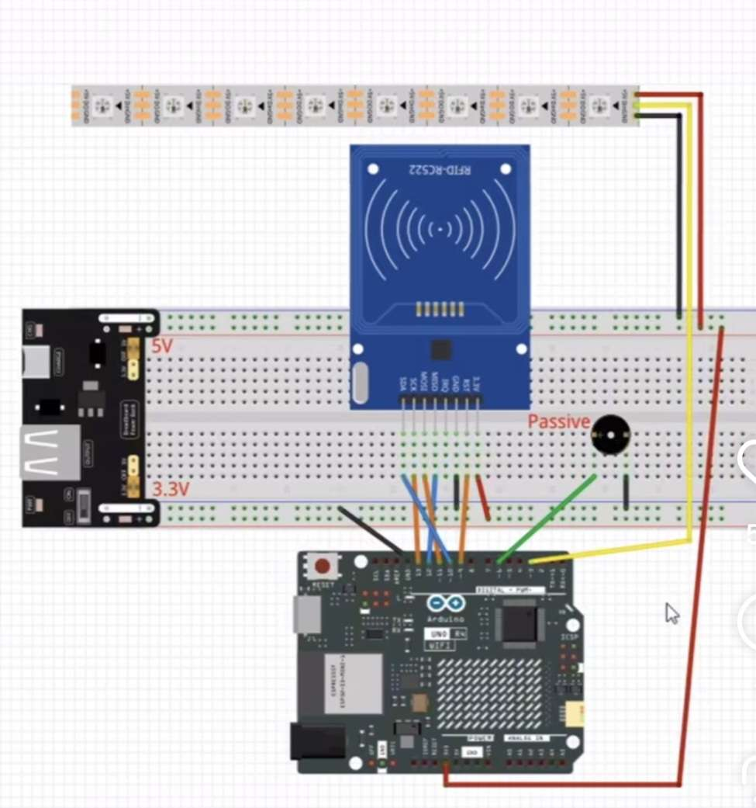

# Hackathon Ynov Materials 10/2025

This repository contains all the materials and resources for the Hackathon organized for Ynov during October 2025.

This includes:

- Resources specific for this hackathon in `/resources`
- A IoT sample project in `IoTSample/`
- - An arduino code reading a RFID card and sending data in the Serial Monitor
- - A NodeJS backend receiving data from the Arduino and sends it with a websocket
- - A basic vanilla JS frontend displaying data received from the websocket that is displayed on a 4.5inch screen
- The code that served generating the dataset and the dictionary for IA/Data challenge in `IaData/`
- Grading scales inside an interactive Excel file in `NotationHackathon.xlsx`
- A python script to calculate statistics from the grading in `extract_notation.py`

## IoT Sample Project

This project is a simple demonstration/example of an IoT system using Arduino, NodeJS, and a web frontend for the students to have a starting point for their own projects.

## IA/Data Challenge

The python script provides a way to generate a dataset and a dictionary for the IA/Data challenge. The dataset consists of random data points, and the dictionary maps these data points to specific labels.

## Grading Scales

The grading scales are provided in an interactive Excel file named `NotationHackathon.xlsx`. This file allows instructors to easily grade and provide feedback on student projects.

The python script `extract_notation.py` can be used to extract and analyze the grading data from the Excel file, providing insights into student performance.
